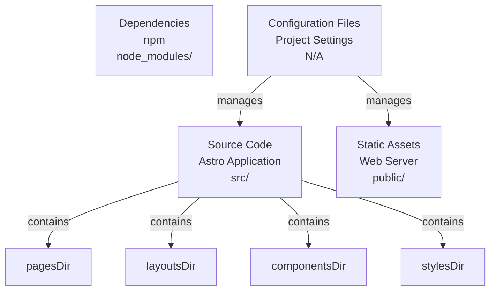
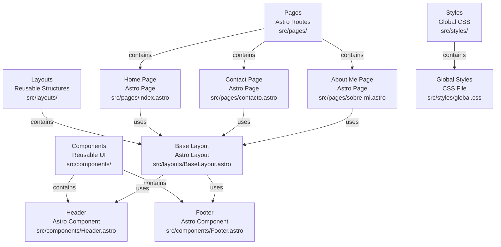
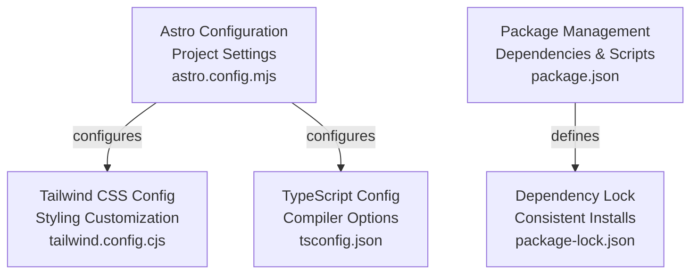
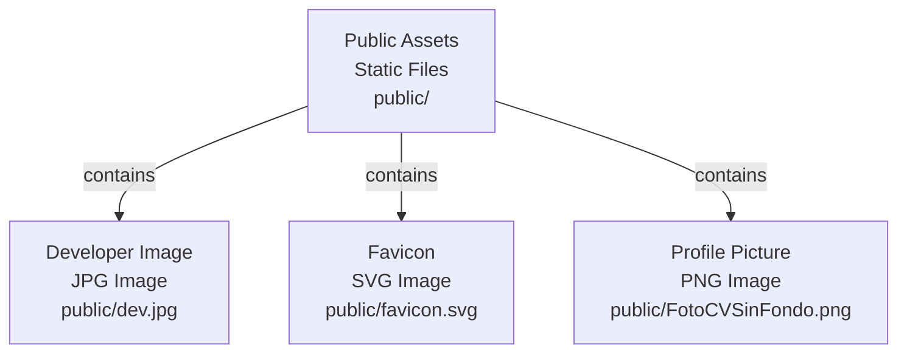

# Codebase Research Report

## Query
documenta mi proyecto

## Answer
# Project Documentation

This document provides a high-level overview and detailed breakdown of the project's structure, core components, and configurations. The project is built using **Astro**, a modern static site builder, leveraging **Tailwind CSS** for styling.

## High-Level Architecture

The project follows a typical Astro project structure, separating concerns into distinct directories for pages, layouts, components, and static assets.

*   **`src/`**: Contains all the source code for the Astro application, including pages, layouts, components, and styles. This is where the main logic and content reside.
*   **`public/`**: Stores static assets that are served directly by the web server without any processing by Astro. This includes images, fonts, and other static files.
*   **`node_modules/`**: Contains all the project's dependencies installed via npm.
*   **Configuration Files**: Root-level configuration files manage the build process, styling, and development environment.

## Core Components

### Pages

The **`src/pages/`** directory contains the main routes of the website. Each `.astro` file in this directory typically corresponds to a unique URL path.

*   **Home Page** [index.astro](src/pages/index.astro): The main landing page of the portfolio.
*   **Contact Page** [contacto.astro](src/pages/contacto.astro): Provides information and a form for contacting the portfolio owner.
*   **About Me Page** [sobre-mi.astro](src/pages/sobre-mi.astro): Details about the portfolio owner's background, skills, and experience.

### Layouts

The **`src/layouts/`** directory defines reusable page structures. Layouts wrap page content, providing consistent headers, footers, and overall page scaffolding.

*   **Base Layout** [BaseLayout.astro](src/layouts/BaseLayout.astro): The fundamental layout used across most, if not all, pages, ensuring a consistent look and feel. It likely includes common elements like the header, footer, and meta tags.

### Components

The **`src/components/`** directory houses smaller, reusable UI elements that can be composed together to build pages and layouts.

*   **Footer** [Footer.astro](src/components/Footer.astro): A common component for displaying copyright information, navigation links, or social media icons at the bottom of pages.
*   **Header** [Header.astro](src/components/Header.astro): A common component for displaying the site's navigation, logo, or title at the top of pages.

### Styles

The **`src/styles/`** directory contains global CSS files that apply styles across the entire application.

*   **Global Styles** [global.css](src/styles/global.css): Contains custom global styles that complement or override the default Tailwind CSS utility classes.

## Configuration

### Astro Configuration

The **`astro.config.mjs`** file is the primary configuration for the Astro project. It defines integrations, build options, and other project-specific settings.

*   **Configuration File** [astro.config.mjs](astro.config.mjs)

### Tailwind CSS Configuration

The **`tailwind.config.cjs`** file customizes the Tailwind CSS framework. It allows for extending themes, adding custom utility classes, and configuring purge paths.

*   **Configuration File** [tailwind.config.cjs](tailwind.config.cjs)

### TypeScript Configuration

The **`tsconfig.json`** file configures the TypeScript compiler for the project, defining compilation options, file inclusions, and type checking rules.

*   **Configuration File** [tsconfig.json](tsconfig.json)

### Package Management

The **`package.json`** file lists project metadata, scripts, and dependencies. **`package-lock.json`** ensures consistent dependency installations.

*   **Project Dependencies and Scripts** [package.json](package.json)
*   **Dependency Lock File** [package-lock.json](package.json)

## Assets

### Public Assets

The **`public/`** directory contains static assets directly accessible via the web server.

*   **Developer Image** [dev.jpg](public/dev.jpg): An image likely used to represent the developer or in a hero section.
*   **Favicon** [favicon.svg](public/favicon.svg): The icon displayed in browser tabs and bookmarks.
*   **Profile Picture** [FotoCVSinFondo.png](public/FotoCVSinFondo.png): A profile picture, possibly for an "About Me" section or resume.

---
*Generated by [CodeViz.ai](https://codeviz.ai) on 7/12/2025, 6:24:14 PM*
